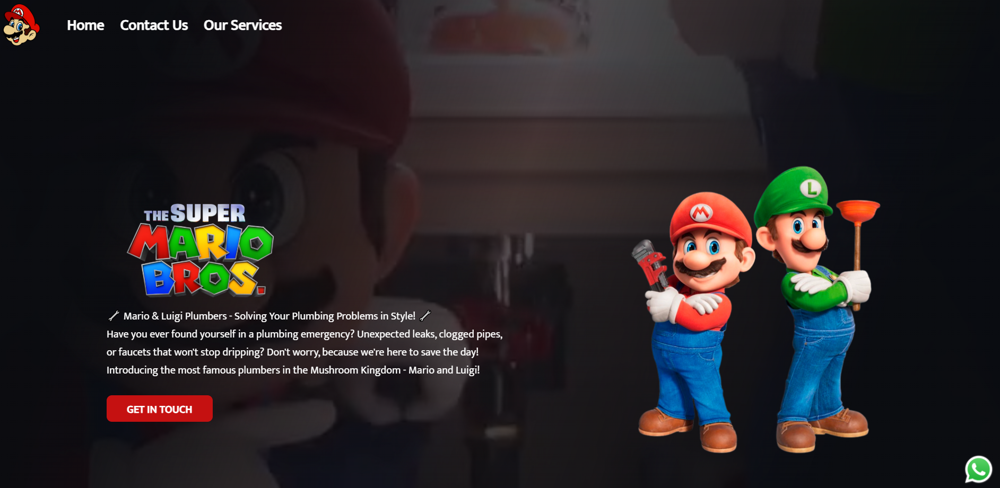

🍄 Service Hero Template

A responsive landing page template inspired by retro gaming aesthetics, built with HTML, CSS, and JavaScript for promoting local service businesses such as plumbers, electricians, gardeners, technicians, and other professionals.

📸 Preview

🚀 Live Demo

https://moniquegananca88.github.io/Service-Hero-Template/

✨ Features
Responsive design
Hero section with strong call-to-action
WhatsApp contact integration
Promotional video section
Modern and engaging UI
Custom favicon support
Reusable structure for different service businesses
Clean and intuitive navigation
🛠️ Technologies Used
HTML5
CSS3
JavaScript
Git
GitHub
GitHub Pages
⚙️ Getting Started

Clone the repository:

git clone https://github.com/moniquegananca88/Service-Hero-Template.git

cd Service-Hero-Template

Open the index.html file in your browser or use the Live Server extension in VS Code.

📂 Project Structure
Service-Hero-Template/
├── assets/
├── icon/
├── image.png
├── index.html
└── style.css
🎯 Purpose

This project was created as a reusable landing page template for local service providers. It can be easily customized for various business niches and marketing campaigns.

👩‍💻 Developed By

Monique Ganança

GitHub: https://github.com/moniquegananca88